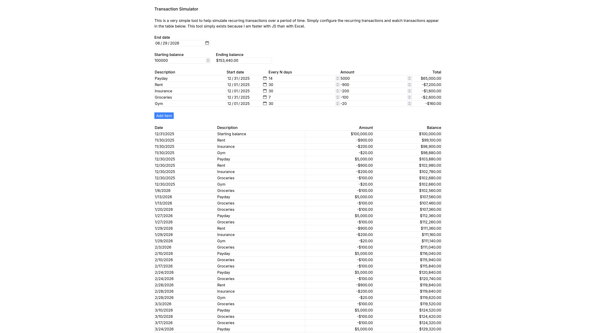

# `simulator`

This is a very simple tool to help simulate recurring transactions over a period of time.
Simply configure the recurring transactions and watch transactions appear in the table below.
This tool exists because I am faster with JS than with Excel.



## Developing

Once you've installed dependencies with `pnpm install`, start a development server:

```bash
pnpm run dev

# or start the server and open the app in a new browser tab
pnpm run dev -- --open
```

## Building

To create a production version of your app:

```bash
pnpm run build
```

You can preview the production build with `pnpm run preview`.

> To deploy your app, you may need to install an [adapter](https://svelte.dev/docs/kit/adapters) for your target environment.
